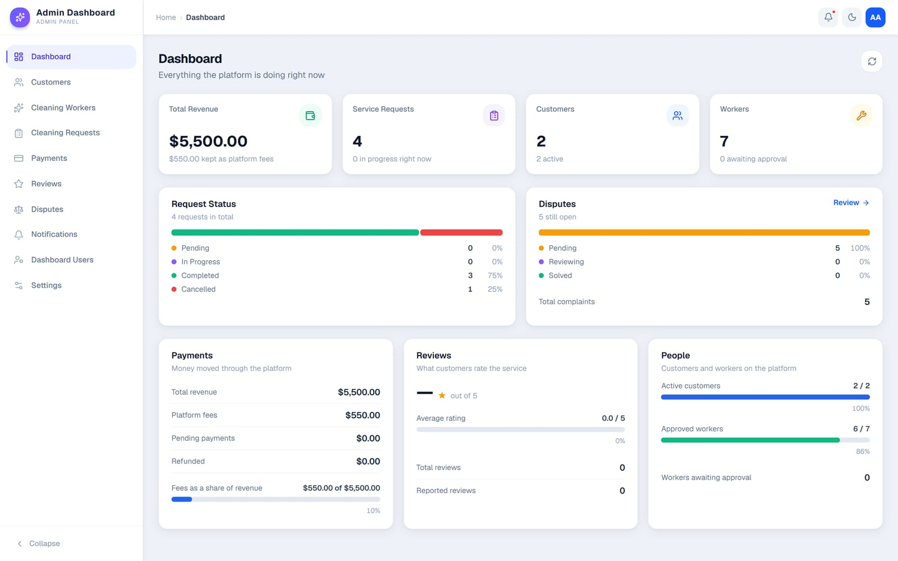
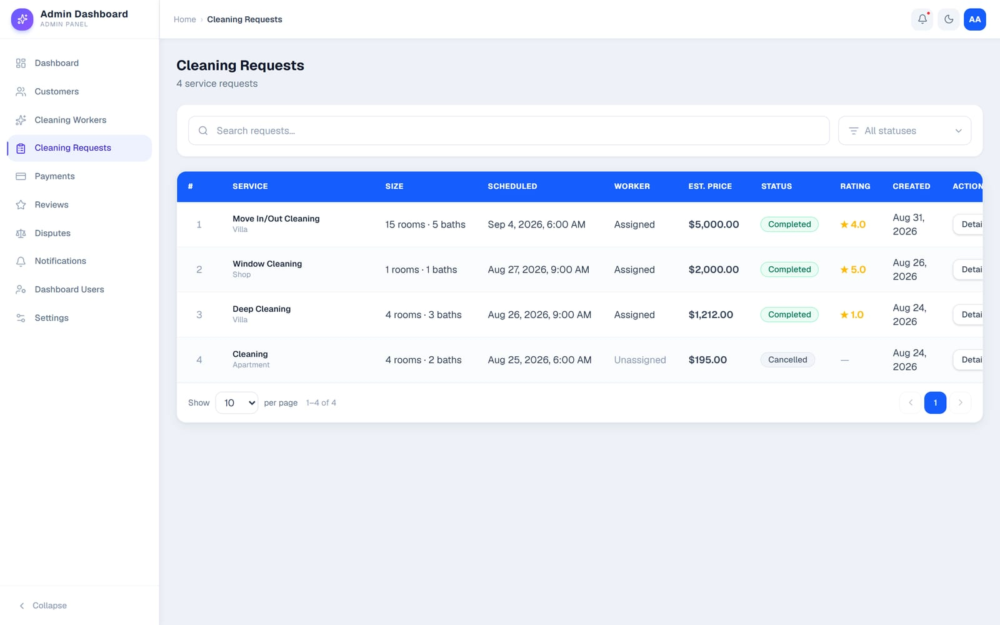
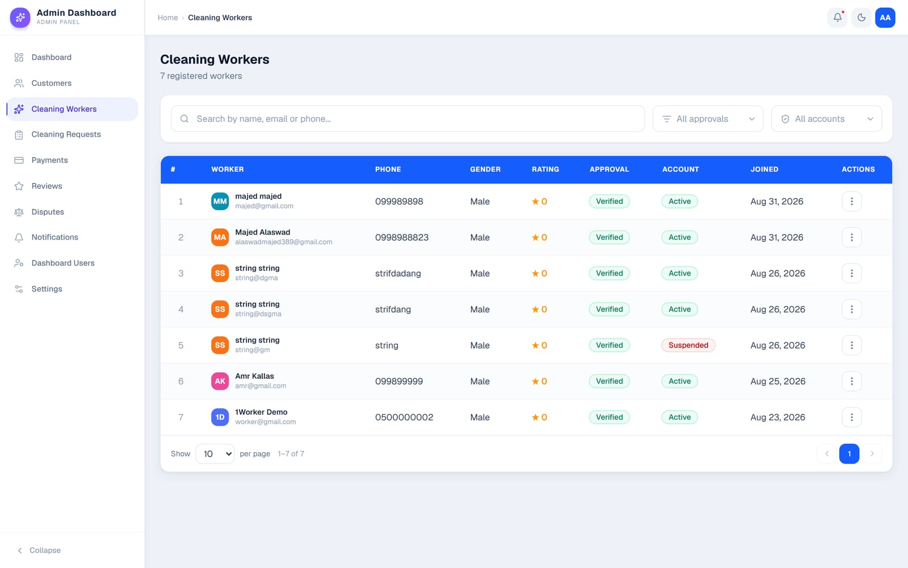
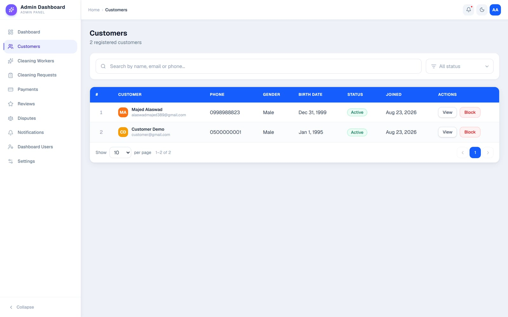
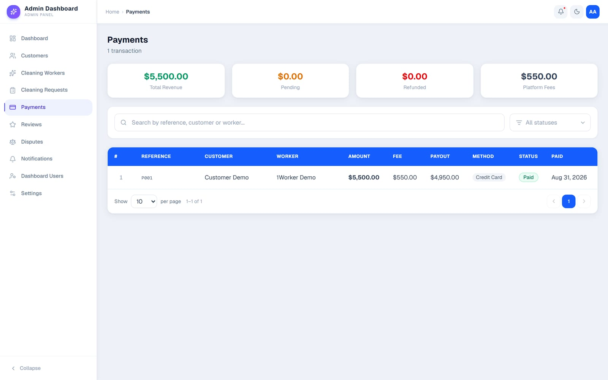
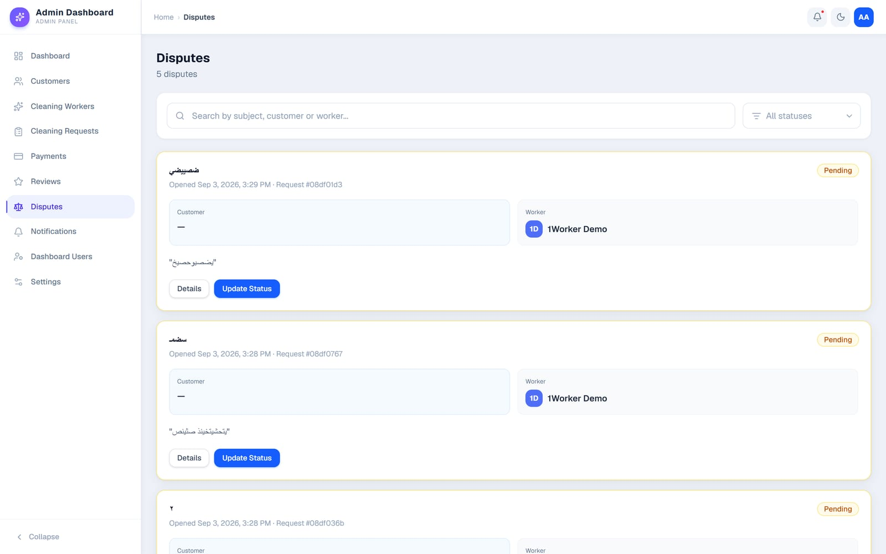
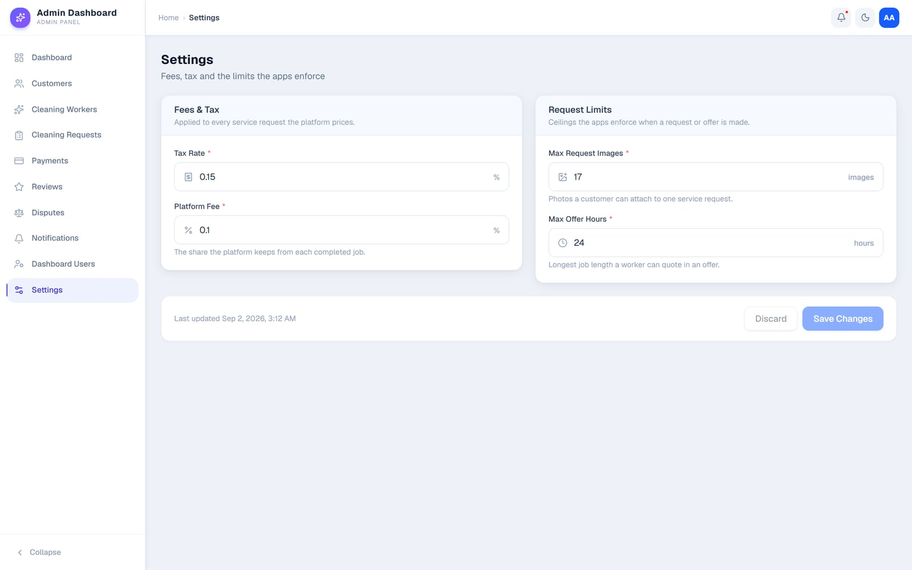
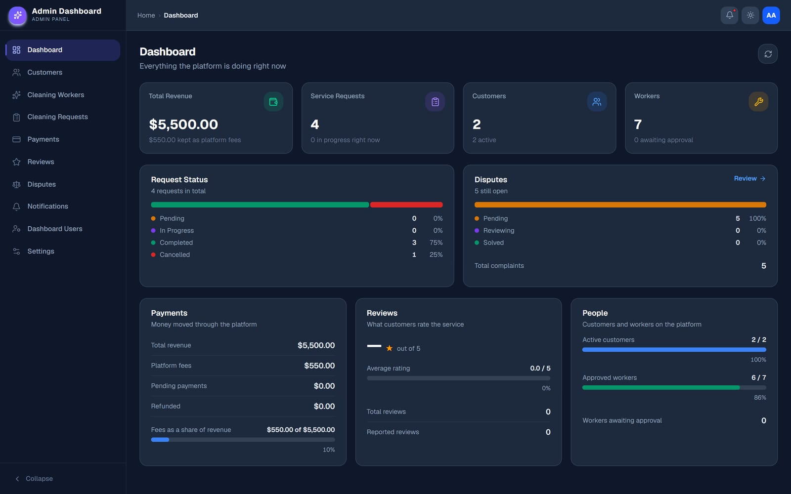

## About

Dar Care is a marketplace that connects households with cleaning workers. This
is the admin panel the operations team uses to run it: who is booked, who got
paid, and what went wrong.

I built the dashboard from scratch.

## The Dashboard

The landing view answers the questions the team asks every morning — revenue
and the platform's cut, how many requests are open, how many workers are still
waiting for approval — with charts I drew as plain SVG rather than pulling in a
charting library.

p]:grid [&>p]:gap-1 [&_img]:m-0 [&_img]:object-cover">
  

## Bookings, Workers & Customers

A cleaning request moves through a lifecycle — new, waiting for offers,
negotiating, accepted, in progress, completed, cancelled — and the requests
table is where the team steers it.

p]:grid [&>p]:gap-1 [&_img]:m-0 [&_img]:object-cover">
  

Workers are onboarded through a multi-step form and carry an approval state, an
account state and a rating. Customers get the same treatment on their side.

p]:grid [&>p]:gap-1 [&>p]:md:grid-cols-2 [&_img]:m-0 [&_img]:object-cover">
   

## Money & Conflict

Payments show what the customer paid, the fee the platform kept and what the
worker is owed. Disputes are where a booking went wrong, and each one can be
worked and resolved in place.

p]:grid [&>p]:gap-1 [&>p]:md:grid-cols-2 [&_img]:m-0 [&_img]:object-cover">
   

Settings hold the fees, tax and limits the customer and worker apps enforce, so
operations can change the platform's economics without a deploy.

p]:grid [&>p]:gap-1 [&_img]:m-0 [&_img]:object-cover">
  

## Dark Mode

The whole app has a dark theme — every table, chart and form, not just the shell.

p]:grid [&>p]:gap-1 [&_img]:m-0 [&_img]:object-cover">
  

## How it is built

The codebase is organized feature-first — every feature owns its API layer,
components and validation schemas, so nothing leaks between them.

Routing is [TanStack Router](https://tanstack.com/router) configured in code,
with the session check in `beforeLoad`: an unauthenticated visitor is bounced
to `/login` carrying a `?redirect=` back to wherever they were headed.

Tables share one set of hooks for pagination, sorting, filtering and row
selection, and each table's state lives in the URL — so a filtered view is a
link you can send to someone.

## Tech

React 19 with the React Compiler, TypeScript, Vite, TanStack Router and Query,
Tailwind CSS v4 with Base UI primitives, and React Hook Form + Yup.
