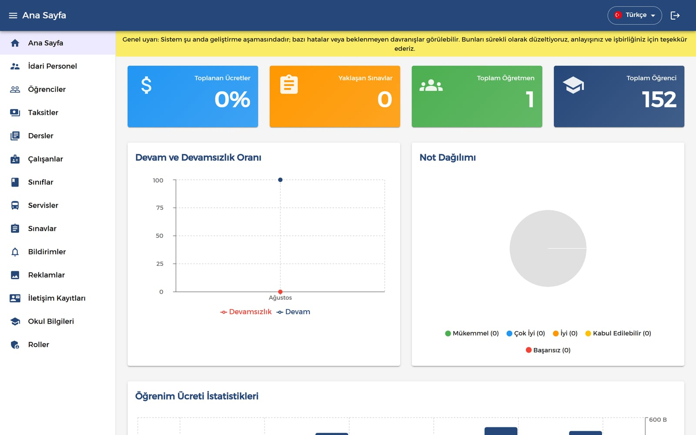
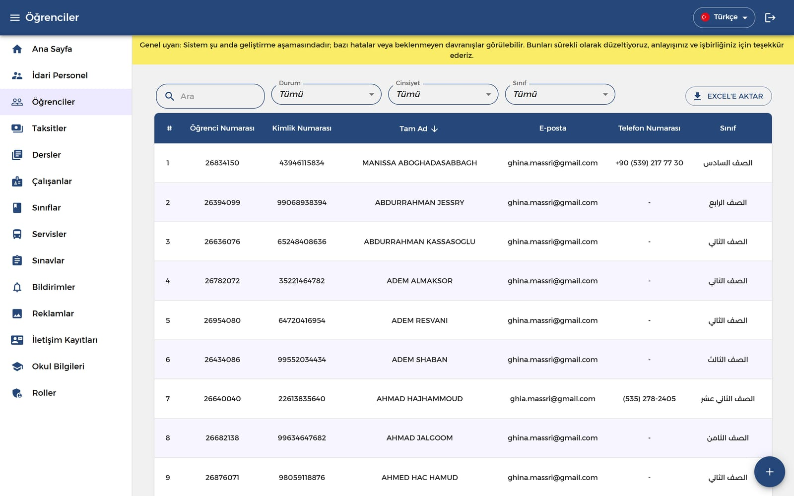
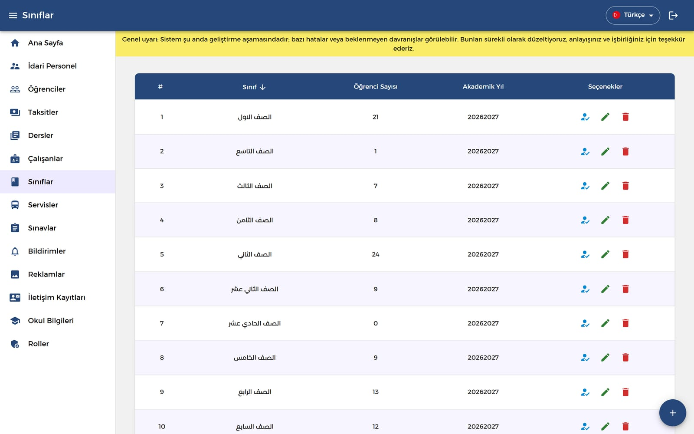
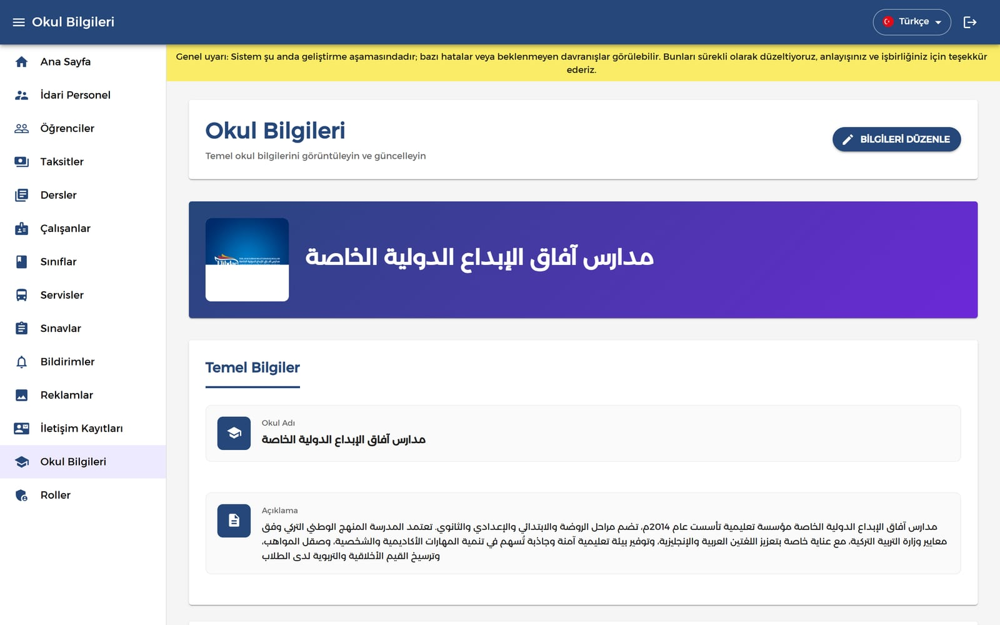
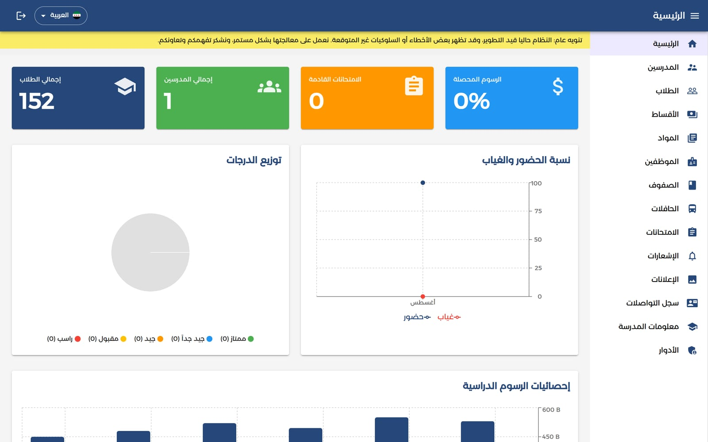

## About

Elibdae is the administration dashboard for **Afak Elibdae International
Schools**. It replaces the paper and spreadsheets a school runs on: enrolment,
timetables, marks, attendance, transport and money.

I built the dashboard front-end.

## The Overview

The home page is the principal's view of the school — headcounts, upcoming
exams, how much tuition has actually been collected, attendance over time, and
where the grades sit.

p]:grid [&>p]:gap-1 [&_img]:m-0 [&_img]:object-cover">
  

## Students & Classes

Every student has a full record — enrolment number, national ID, guardian
contact, documents, nationality and class. The table filters by status, gender
and class, and exports to Excel.

p]:grid [&>p]:gap-1 [&_img]:m-0 [&_img]:object-cover">
  

Classes are the structure everything else hangs off — each one carries its
student count and academic year, and the subjects, exams and attendance pages
all filter against it.

p]:grid [&>p]:gap-1 [&>p]:md:grid-cols-2 [&_img]:m-0 [&_img]:object-cover">
   

## The Rest of the School

- **Teachers & employees** — staff records, the subjects they teach, and the
  permissions their account carries.
- **Exams & marks** — exam scheduling per class, then per-student mark entry.
- **Attendance** — taken daily, per class, and fed back into the overview chart.
- **Installments** — tuition derived from the year's fee for a grade level, split
  into monthly installments with paid and outstanding balances tracked per student.
- **Buses** — routes with a driver and a supervisor, and the students assigned
  to each one.
- **Roles** — a role builder deciding which modules each staff account can open.
- **Ads, contact records & school info** — the content the public site reads from.

p]:grid [&>p]:gap-1 [&_img]:m-0 [&_img]:object-cover">
  

## Arabic & Turkish

The school runs in two languages, so the dashboard does too. `i18next` handles
the translations and `stylis-plugin-rtl` flips the whole Material-UI theme for
Arabic — navigation, tables, forms, and the charts' own axes and legends.

p]:grid [&>p]:gap-1 [&_img]:m-0 [&_img]:object-cover">
  

## Reports

Report pages render to PDF in the browser with `jsPDF` and `html2canvas`, so
staff can print a student file or a marks sheet without a backend export step.

## Tech

React 18, TypeScript, Vite, Material-UI v5 with MUI X Date Pickers Pro,
TanStack Query, React Hook Form + Yup, `react-window` for long tables,
`react-easy-crop` for profile photos, and Firebase for push notifications.
