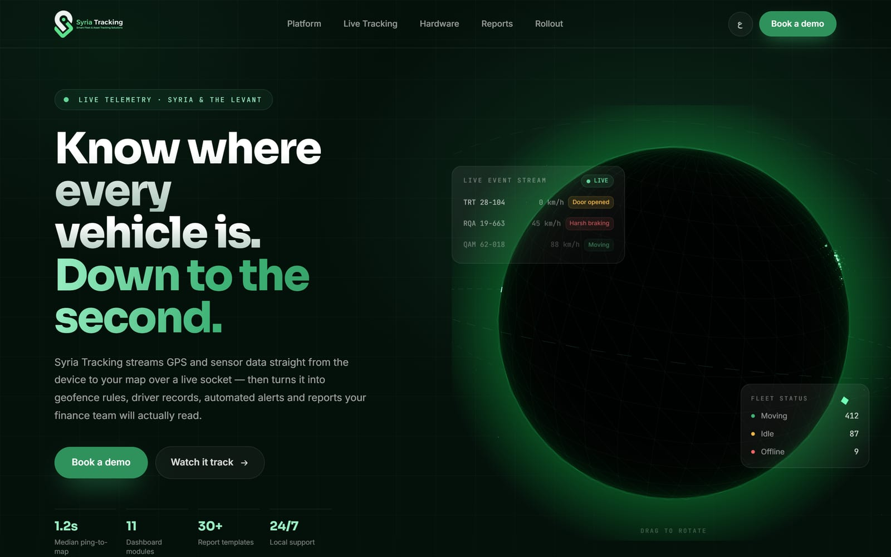
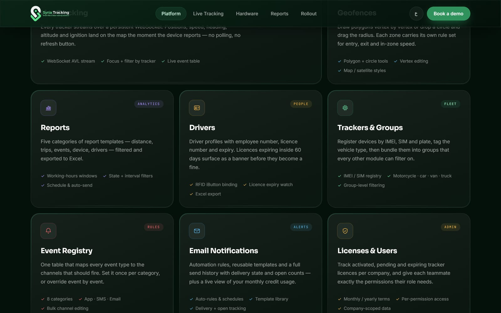
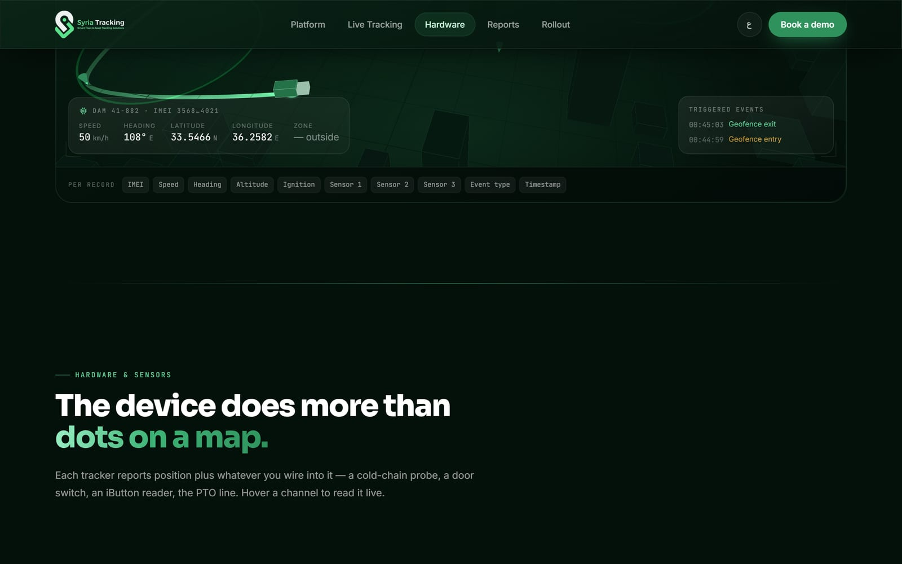

## About

The public site for [Syria Tracking](/projects/syria-tracking), the fleet
platform I built the dashboard for. Its job is to make an abstract product —
GPS packets arriving over a socket — feel concrete before anyone signs in.

- Live: [syriatracking.com](https://syriatracking.com/en.html)

## The Hero

Instead of a screenshot, the hero puts a rotating 3D globe behind the copy,
built with [Three.js](https://threejs.org/), with a live event stream and fleet
status floating over it. You can drag it.

p]:grid [&>p]:gap-1 [&_img]:m-0 [&_img]:object-cover">
  

## Showing the Product

Every module in the dashboard gets a card that says what it actually does,
rather than a feature bullet — live tracking, geofences, reports, drivers,
trackers, the event registry, email notifications, licenses and users.

p]:grid [&>p]:gap-1 [&_img]:m-0 [&_img]:object-cover">
  

Further down, a section shows what a tracker reports beyond a dot on a map —
a cold-chain probe, a door switch, an iButton reader, the PTO line — with a
3D scene and a telemetry readout you can hover channel by channel.

p]:grid [&>p]:gap-1 [&_img]:m-0 [&_img]:object-cover">
  

## Arabic & English

The site ships in both languages, each as its own statically exported page,
with the Arabic version fully mirrored to RTL.

## Tech

Next.js 16 with React 19 and Tailwind CSS v4, exported to static HTML so the
whole site is plain files on a CDN — no server. A post-build step
pre-compresses the output, and Three.js drives the 3D scenes.
