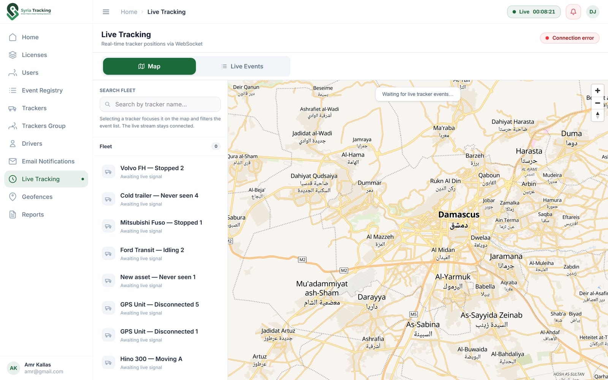
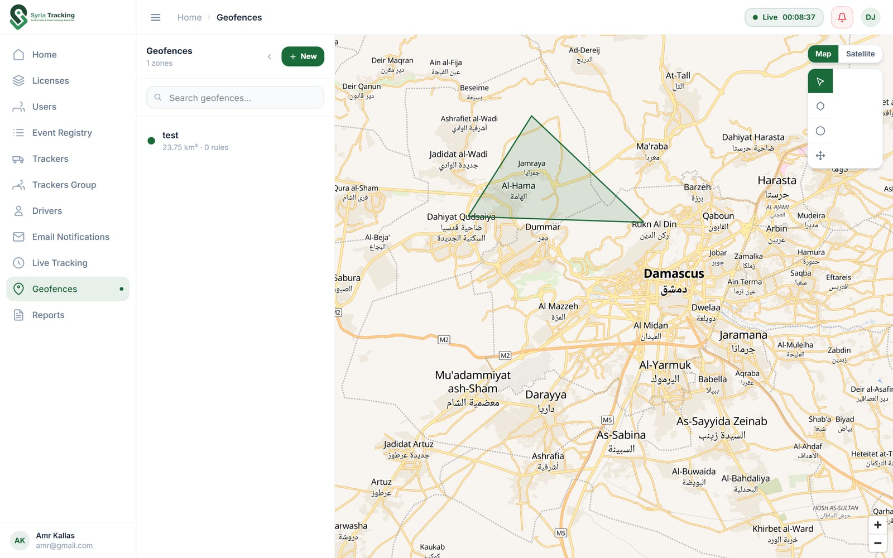
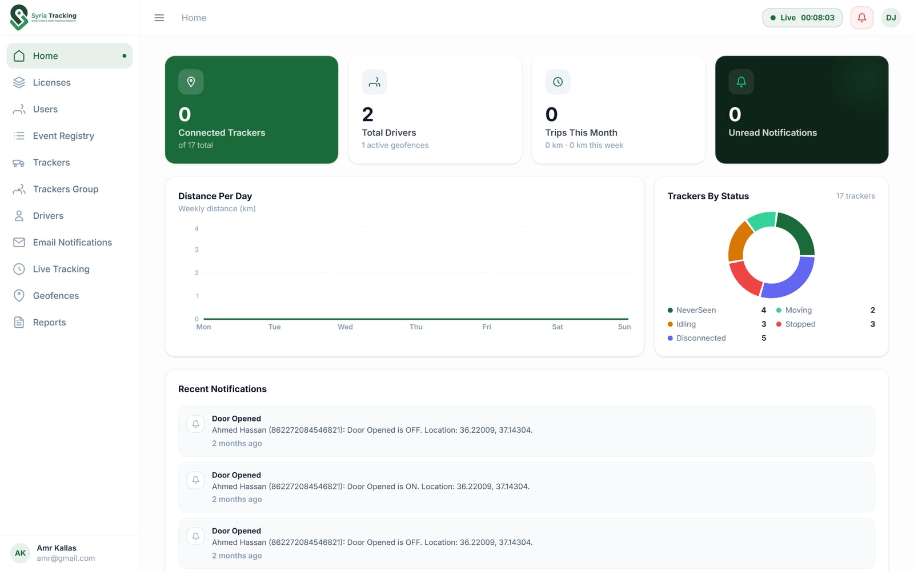
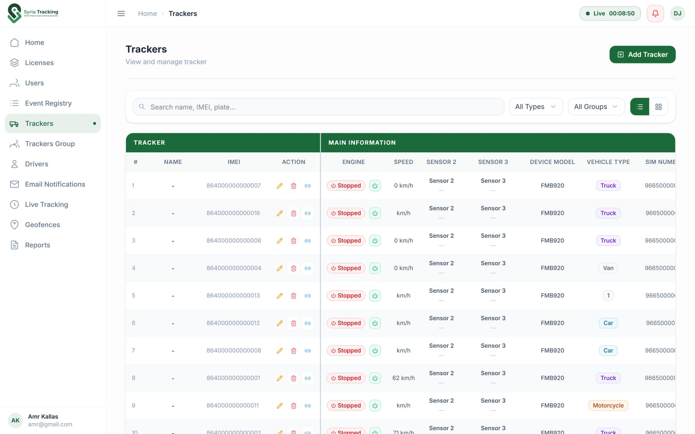
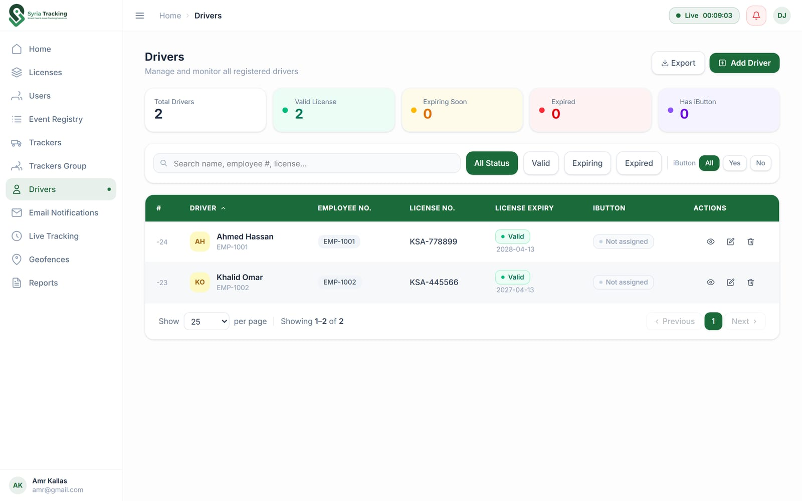
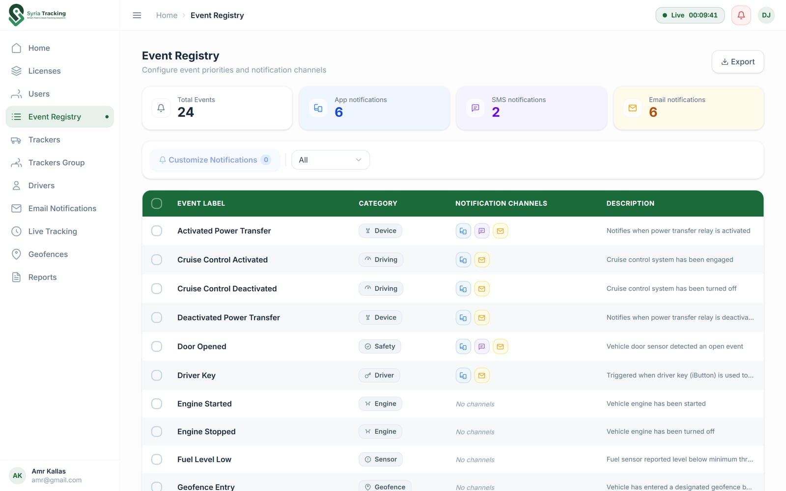
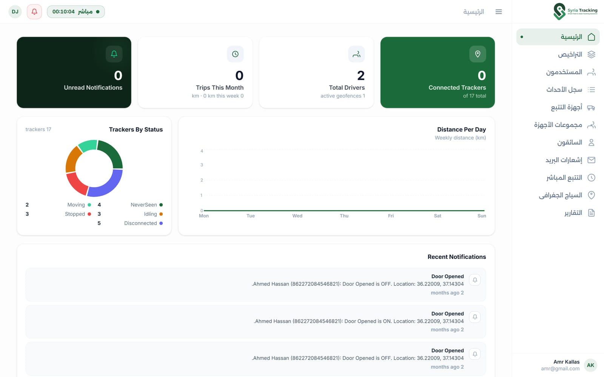

## About

Syria Tracking is a fleet management platform that lets companies watch every
vehicle they own on a live map, replay where it has been, and get alerted the
moment something happens.

I built the whole front-end: the dashboard, the mapping layer, and the
internationalization setup.

- The marketing site is a separate project: [Syria Tracking Website](/projects/syria-tracking-site)

## Live Tracking & Maps

The map is the heart of the product, built with
[MapLibre GL](https://maplibre.org/) through `react-map-gl`. Tracker positions
arrive over a WebSocket and land on the map the moment the device reports —
no polling, no refresh button.

p]:grid [&>p]:gap-1 [&_img]:m-0 [&_img]:object-cover">
  

Geofences are drawn straight on the map — polygons vertex by vertex, or a
circle you drag to size — with [Turf.js](https://turfjs.org/) doing the area,
radius and distance math. Each zone carries its own rules for entry, exit and
in-zone speed, and the map switches between vector and satellite styles.

p]:grid [&>p]:gap-1 [&_img]:m-0 [&_img]:object-cover">
  

## The Dashboard

The home page opens on the fleet's current state: connected trackers, driver
count, distance this week, and a breakdown of every tracker by status.

p]:grid [&>p]:gap-1 [&_img]:m-0 [&_img]:object-cover">
  

Around it sits the rest of the platform:

- **Trackers & tracker groups** — devices registered by IMEI, SIM and plate,
  tagged by vehicle type and bundled into groups every other module can filter on.
- **Drivers** — profiles with licence numbers and expiry, RFID iButton binding,
  and a banner for licences about to expire.
- **Event registry** — one table mapping each event type to the channels that
  should fire it: app, SMS or email.
- **Reports** — five report categories, each configurable and exportable to
  Excel with `ExcelJS`.
- **Licenses, users & permissions** — every route and nav item is gated behind
  a permission, so each role only sees what it is allowed to.

p]:grid [&>p]:gap-1 [&>p]:md:grid-cols-2 [&_img]:m-0 [&_img]:object-cover">
   
   

## Arabic & English

The whole app runs through [`next-intl`](https://next-intl.dev/) with a
`[locale]` segment in the App Router. Switching to Arabic mirrors the entire
layout to RTL — navigation, tables, charts and the map's own text rendering
(`mapbox-gl-rtl-text`).

p]:grid [&>p]:gap-1 [&_img]:m-0 [&_img]:object-cover">
  

## Tech

Next.js 15 App Router, React 19, TypeScript, Tailwind CSS v4, Radix UI,
TanStack Query with `query-key-factory`, React Hook Form + Yup, Recharts, and
Firebase Cloud Messaging for push notifications.
